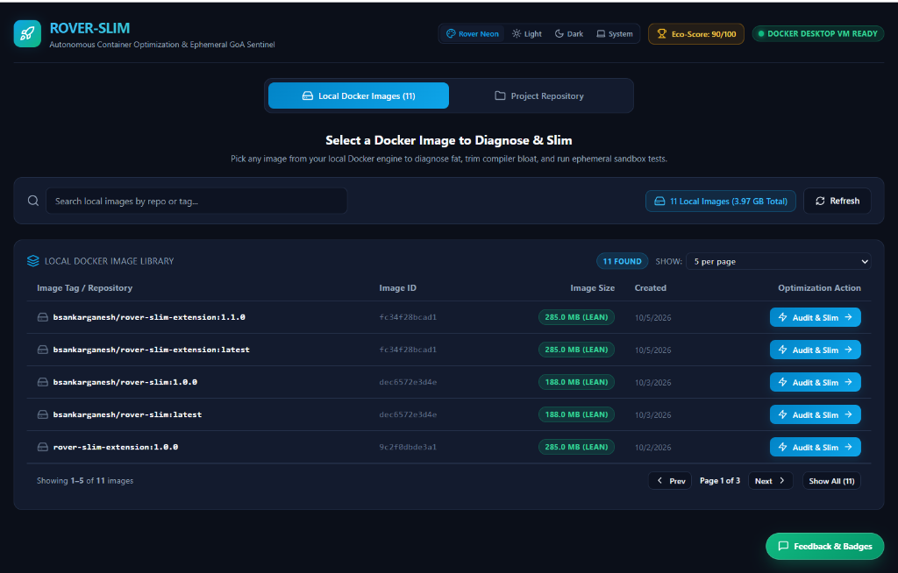

# 🚀 Rover-Slim: Autonomous Container Optimization Engine & Docker Desktop Extension

[](https://open.docker.com/extensions/marketplace?extensionId=bsankarganesh/rover-slim-extension&tag=latest)
[](https://github.com/SankarGaneshb/rover-slim/actions)
[](https://github.com/SankarGaneshb/rover-slim)
[](https://open.docker.com/extensions/marketplace?extensionId=bsankarganesh/rover-slim-extension&tag=latest)
[](https://python.org)
[](https://opensource.org/licenses/MIT)

**Rover-Slim** is an intelligent, source-first container optimization engine and official **Docker Desktop Extension** that analyzes application Abstract Syntax Trees (AST), automatically segregates development bloat from minimal production dependencies, synthesizes hardened multi-stage Dockerfiles, and guarantees zero runtime breakage via **Green-on-Arrival (GoA)** Sentinel health checks.

---

## 📸 Docker Desktop Extension Dashboard



---

## 🎯 Key Capabilities

- **🧬 AST-Driven Dependency Segregation**: Parses Python source syntax trees to detect genuine runtime `import` statements, generating lean `requirements-prod.txt` while quarantining dev tools (`pytest`, `black`, `ruff`, `locust`).
- **🏗️ Deterministic Multi-Stage Synthesis**: Synthesizes 2-stage and 3-stage minimal multi-arch Dockerfiles running under unprivileged non-root users (`appuser`, UID `10001`).
- **🛡️ Context Shielding (`.dockerignore`)**: Automatically detects and shields build contexts from heavy test caches, `.git`, `node_modules`, and local state.
- **⚡ Green-on-Arrival (GoA) Sentinel**: Boots ephemeral container sandboxes to verify startup integrity, validate active HTTP health probes (`/health`), and verify static asset graphs before final deployment.
- **🐳 Docker Desktop Extension Workbench**: Interactive visual studio featuring live KPI gauges, 2-column drag-and-drop dependency classifier, side-by-side Monaco diff inspector, 1-click **Apply** with safety checkpoint rollback, and export hub.
- **🤖 Model Context Protocol (MCP) Server**: Built-in stdio MCP server for agentic IDEs (Antigravity, Cursor, Claude Desktop).

---

## 📊 Performance Benchmarks (Real-World Service)

| Metric | Fat / Baseline Container | Rover-Slim Optimized | Total Savings / Delta |
|---|---|---|---|
| **Uncompressed Image Size** | 1,232.7 MB | **214.6 MB** | **-1,018.1 MB (-82.6%)** |
| **Registry Transfer (Compressed)** | 443.8 MB | **68.7 MB** | **-375.1 MB (-84.5%)** |
| **Build Context Size** | 10.2 MB | **2.4 MB** | **-7.8 MB (-76.5%)** |
| **OCI Image Layers** | 18 layers | **8 layers** | **-10 layers** |
| **Installed Packages** | 40 packages | **12 packages** | **-28 packages** |
| **Runtime GoA Sentinel** | Untested / Breakage Risk | **100% Verified Green** | **Zero Breaking Changes** |

---

## 🐳 Docker Desktop Extension

### 1. One-Click Install in Docker Desktop
Click below to open Docker Desktop directly and install Rover-Slim:

[](https://open.docker.com/extensions/marketplace?extensionId=bsankarganesh/rover-slim-extension&tag=latest)

Or install via Docker CLI:
```bash
docker extension install bsankarganesh/rover-slim-extension:latest
```

### 2. Launch the Extension
Open **Docker Desktop** and click **Rover Slim** in the left navigation sidebar!

### 3. Extension Features
- **Library Discovery**: Select local Docker images or project repositories.
- **Interactive Matrix**: Review and customize package splits (Production vs. Development).
- **Diff Inspector**: Inspect generated multi-stage Dockerfiles side-by-side.
- **GoA Sentinel**: Run live HTTP health probes and ephemeral container sandboxes.
- **Export Hub**: Generate GitHub PR descriptions, CI/CD YAML workflows, and SBOMs.

---

## 💻 CLI Usage & Quickstart

### 1. Install Core CLI
```bash
pip install -e .
```

### 2. Audit Container & Bloat
```bash
# Audit current directory or existing Docker image
rover-slim audit .
rover-slim audit . --image my-app:latest
```

### 3. Run End-to-End Optimization
```bash
# Run AST segregation, Dockerfile synthesis, and GoA verification
rover-slim optimize . --verify-goa

# Interactive wizard mode
rover-slim optimize . --interactive

# Multi-Architecture build output (amd64 + arm64)
rover-slim optimize . --multi-arch
```

### 4. View Side-by-Side Structural Diff
```bash
rover-slim diff .
```

### 5. Generate Software Bill of Materials (SBOM)
```bash
# Generates SPDX 2.3 and CycloneDX 1.5 SBOMs
rover-slim sbom . --output .rover-slim
```

### 6. Continuous File Watcher Mode
```bash
# Automatically synchronizes requirements-prod.txt upon source code edits
rover-slim watch .
```

### 7. Safety Rollback Checkpoints
```bash
# Restores files from previous snapshot backup
rover-slim rollback .
```

---

## 🤖 Model Context Protocol (MCP) Server

Rover-Slim includes a native Model Context Protocol (MCP) server for integration with agentic coding environments:

```json
{
  "mcpServers": {
    "rover-slim": {
      "command": "rover-slim",
      "args": ["mcp"]
    }
  }
}
```

---

## ⚙️ Configuration (`.rover-slim.yaml`)

```yaml
version: "1.0"
project_name: "my-service"

thresholds:
  max_image_size_mb: 350.0
  max_wasted_percent: 10.0
  max_cold_start_seconds: 2.5
  fail_on_cve_severity: ["CRITICAL"]

build:
  target_base_image: "python:3.13-slim"
  enable_multistage: true
  strip_node_runtime: true
  frontend_dist_path: "static/"

verification:
  auto_discover: true
  startup_command: "python -c 'import server; print(\"[OK] Startup Integrity verified\")'"
  probes:
    - name: "HTTP Root Health"
      type: "http"
      path: "/health"
      port: 8080
      expected_status: 200
      timeout_seconds: 10
```

---

## 🧪 Testing & Verification

```bash
# Run full Python test suite (81 tests, 90% coverage)
pytest -v --cov=rover_slim --cov-report=term-missing

# Run Extension React UI component test suite (6 suites, 100% green)
cd extension/ui && npm test
```

---

## 📄 License

This project is licensed under the [MIT License](LICENSE).
